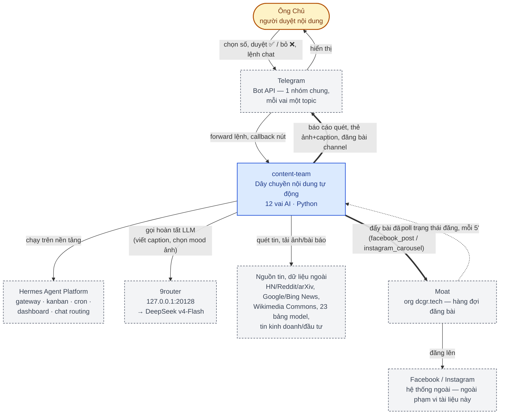
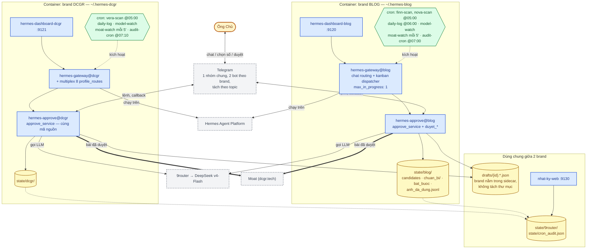
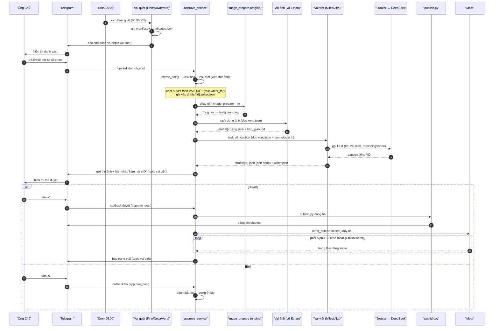

# Kiến trúc hệ thống — content-team

Tài liệu này vẽ lại kiến trúc của `content-team` bằng sơ đồ, theo cách phân lớp
của **mô hình C4** (Context → Container → Component) cho phần cấu trúc tĩnh, và
**sơ đồ trình tự** cho chiều dữ liệu động. Toàn bộ vẽ bằng **Mermaid** (text
thuần, diff được trong git, không cần công cụ vẽ tay) — mở trực tiếp trên
GitHub/GitLab hoặc bất kỳ trình xem Markdown nào hỗ trợ Mermaid, hoặc paste vào
https://mermaid.live để xem nhanh.

Nguồn sự thật về **hành vi chi tiết** vẫn là [README.md](README.md); tài liệu
này chỉ là bản đồ tổng quan, dựng lại từ README.md tại thời điểm **2026-09-08**.
Khi kiến trúc đổi thật (thêm vai, đổi hạ tầng, đổi luồng duyệt) — sửa cả hai
trong cùng một commit, xem mục [Bảo trì sơ đồ](#bảo-trì-sơ-đồ) ở cuối.

## Quy ước ký hiệu (đọc trước)

Một bộ hình khối + màu duy nhất, dùng lại cho **mọi** sơ đồ bên dưới — không
thêm khối/màu nào ngoài bộ này.

```mermaid
flowchart TB
    classDef actor fill:#fef3c7,stroke:#b45309,stroke-width:2px,color:#78350f;
    classDef container fill:#dbeafe,stroke:#1d4ed8,stroke-width:1.5px,color:#1e3a8a;
    classDef llm fill:#ede9fe,stroke:#6d28d9,stroke-width:1.5px,color:#4c1d95;
    classDef datastore fill:#fef9c3,stroke:#a16207,stroke-width:1.5px,color:#713f12;
    classDef cron fill:#dcfce7,stroke:#15803d,stroke-width:1.5px,color:#14532d;
    classDef external fill:#f3f4f6,stroke:#6b7280,stroke-width:1.5px,stroke-dasharray:4 3,color:#374151;

    subgraph SHAPE["Hình khối, màu sắc — vai trò thành phần"]
        direction TB
        s1(["Người: Ông Chủ"]):::actor
        s2["Script / service nội bộ<br/>(Python, đội tự viết)"]:::container
        s3[["Lệnh gọi LLM<br/>(qua 9router)"]]:::llm
        s4[("Kho dữ liệu<br/>file JSON / log / state")]:::datastore
        s5{{"Cron / tác vụ định kỳ"}}:::cron
        s6["Hệ thống ngoài<br/>(Telegram, Moat, Hermes Agent...)"]:::external
    end

    subgraph ARROW["Kiểu mũi tên — chiều và bản chất dữ liệu"]
        direction TB
        x1(("·")) -->|"gọi trực tiếp / thao tác tay"| x2(("·"))
        x3(("·")) -.->|"bất đồng bộ: cron, polling, callback nút bấm"| x4(("·"))
        x5(("·")) ==>|"dữ liệu nội dung chảy qua (ảnh, text, bài viết)"| x6(("·"))
    end
```



## Cấp 1 — Sơ đồ ngữ cảnh hệ thống (System Context)



**Hệ thống ngoài, đọc theo chiều mũi tên:**

- **Hermes Agent Platform** — nền tảng agent bên ngoài (không phải mã của
  đội): cấp gateway đa nền tảng chat, dispatcher kanban, cron, dashboard, bộ
  nhớ (memory) và cơ chế routing model. `content-team` chỉ là **script +
  SOUL/MEMORY** chạy trên nền tảng này qua biến `HERMES_HOME`.
- **9router** — router LLM cục bộ, route tới **DeepSeek v4-Flash** qua 3 đường
  (DeepSeek trực tiếp, xKiro, aellm); `reasoning_effort: none` cho mọi vai nội
  dung.
- **Moat** (org `dcgr.tech`) — hàng đợi đăng bài, nhận `facebook_post` /
  `instagram_carousel`. **Phần của content-team dừng ở đây** — từ Moat trở đi
  (extension trình duyệt claim/đăng thế nào) là hệ thống của người khác, không
  thuộc phạm vi mã nguồn hay tài liệu này.
- **Nguồn tin & dữ liệu ngoài** — HN, Reddit, arXiv, Google News/Bing News
  RSS, Wikimedia Commons, 23 bảng xếp hạng model, feed tin kinh doanh/đầu tư.

## Cấp 2 — Sơ đồ container (theo brand)



**Điểm mấu chốt: một bộ mã, hai tiến trình độc lập.** `content-team` là một bộ
script Python duy nhất ("Cùng một script phục vụ cả hai brand"), nhưng chạy
thành **hai container hoàn toàn tách biệt** — mỗi bên một bộ systemd unit, một
`state/<brand>/` riêng, một cấu hình cron riêng, chạy **tuần tự** trong nội bộ
brand (`kanban.max_in_progress: 1`) nhưng **độc lập song song** giữa hai
brand. Chỉ `drafts/`, `state/9router/`, `state/cron_audit.json` và
`nhat-ky-web` là dùng chung.

## Cấp 3 — Sơ đồ luồng pipeline nội dung (Component / data flow)

Bức tranh trung tâm của cả dự án: một tin đi qua đúng **3 lớp lặp lại cho mỗi
vai** — **CHUẨN BỊ (script, chạy nền) → VIẾT (LLM, một tệp) → NỘP (script)**.

```mermaid
flowchart TD
    classDef actor fill:#fef3c7,stroke:#b45309,stroke-width:2px,color:#78350f;
    classDef container fill:#dbeafe,stroke:#1d4ed8,stroke-width:1.5px,color:#1e3a8a;
    classDef llm fill:#ede9fe,stroke:#6d28d9,stroke-width:1.5px,color:#4c1d95;
    classDef datastore fill:#fef9c3,stroke:#a16207,stroke-width:1.5px,color:#713f12;
    classDef cron fill:#dcfce7,stroke:#15803d,stroke-width:1.5px,color:#14532d;
    classDef external fill:#f3f4f6,stroke:#6b7280,stroke-width:1.5px,stroke-dasharray:4 3,color:#374151;

    subgraph S1["1 · QUÉT TIN"]
        cron1{{"cron 05:00 VN"}}:::cron
        scan["scan_prepare.py --vai scout|nova|market<br/>Finn / Nova / Vera"]:::container
        manifest["manifest_common/_build/_write<br/>+ required.py"]:::container
        candidates[("candidates_*.json")]:::datastore
        cron1 -.-> scan
        scan --> manifest
        manifest --> candidates
        manifest ==>|"báo cáo đánh số"| tg1["Telegram: topic vai quét"]:::external
    end

    subgraph S2["2 · CHỌN"]
        ocnu1(["Ông Chủ<br/>trả lời số thứ tự"]):::actor
        chontin["approve_pick.py<br/>(trong approve_service)"]:::container
        tg1 -->|"số đã chọn"| ocnu1
        ocnu1 -->|"vd '1,3-Ethan, 2-Dre'"| chontin
    end

    subgraph S3["3 · TẠO CẶP TASK"]
        pair["approve_pick.create_pair<br/>chạy nền image_prepare --im"]:::container
        kanban["Kanban swarm (Hermes)<br/>task ảnh → task viết (chờ ảnh)"]:::external
        blackboard["blackboard.py<br/>ghi bảng đen (create_root/write_background)"]:::container
        chontin --> pair
        pair --> kanban
        pair --> blackboard
    end

    subgraph S4["4 · CHUẨN BỊ CHUNG (engine dùng chung)"]
        prep["image_prepare.py<br/>giải mã link, research, chụp ảnh,<br/>dHash, phân loại, crop 1:1/4:5"]:::container
        xong[("state/{brand}/chuan_bi/{id}/<br/>xong.json + bang_anh.png")]:::datastore
        kanban --> prep
        prep --> xong
    end

    subgraph S5["5 · DỰNG ẢNH (theo vai đã chọn)"]
        imgRole["Ethan (card.py) · Dre (carousel.py) · Kite (render_edu.py)<br/>{vai}_prepare → {vai}_submit"]:::container
    end
    xong --> imgRole
    imgDraft[("drafts/{id}.img.json<br/>+ ban_giao.md")]:::datastore
    imgRole --> imgDraft

    subgraph S6["6 · VIẾT CAPTION"]
        miles["Vai viết (Miles | Jika)<br/>{persona}_prepare → {persona}_submit"]:::container
        llm[["9router → DeepSeek v4-Flash<br/>reasoning_effort: none"]]:::llm
        draftwrite["draft_write.py"]:::container
        miles --> llm
        llm -->|"caption tiếng Việt"| draftwrite
    end
    imgDraft --> miles
    xong --> miles
    capDraft[("drafts/{id}.json (bản nháp)<br/>+ writer.json")]:::datastore
    draftwrite --> capDraft

    subgraph S7["7 · DUYỆT"]
        sendcard["gửi thẻ + bản nháp kèm nút ✅/❌<br/>(topic của vai viết)"]:::container
        ocnu2(["Ông Chủ bấm ✅ / ❌"]):::actor
        duyetbai["approve_post.py"]:::container
        tg2["Telegram: topic vai viết"]:::external
        capDraft --> sendcard
        sendcard ==> tg2
        tg2 --> ocnu2
        ocnu2 --> duyetbai
    end

    subgraph S8["8 · ĐĂNG"]
        pub["publish.py"]:::container
        drop["đánh dấu bỏ — dừng"]:::container
        tgchannel["Telegram channel"]:::external
        pub ==>|"đăng bài"| tgchannel
    end
    duyetbai -->|"✅ Duyệt"| pub
    duyetbai -.->|"❌ Bỏ"| drop

    subgraph S9["9 · MOAT (hết phần của content-team)"]
        moatpush["moat_publish.intake()"]:::container
        moatext["Moat — org dcgr.tech<br/>facebook_post / instagram_carousel"]:::external
        moatpoll{{"cron moat-publish-watch /5'<br/>moat_publish.poll()"}}:::cron
        moatpush ==> moatext
        moatpoll -.->|"trạng thái đăng"| moatext
    end
    pub --> moatpush
    moatpoll -.->|"báo lại"| tg2
```



**Vai không nằm trên đường chính** (không vẽ ở trên để giữ sơ đồ đọc được
trong vài phút — xem chi tiết ở README §"Đội hình"):

- **Gin → Itachi** — kích hoạt qua **chat trực tiếp** (khoá `message_id`/URL),
  **không qua vòng chọn số** ở stage 2. Gin xoá chữ tiếng Anh trên ảnh nền
  (OCR+LaMa), Itachi dựng lại carousel kiểu editorial-deck (`deck.py`) **từ
  nền sạch của Gin** — quan hệ sinh/tiêu thụ trực tiếp giữa hai vai, tách biệt
  khỏi engine `image_prepare.py` dùng chung ở stage 4.
- **Cape** (teaser; persona cũ tên Jean, `role.py` giữ `slug_cu=("jean",)`) — đọc
  bài **đã duyệt xong** (sau stage 8), ghép teaser cho blog, không tham gia vòng
  duyệt.
- **Ada** (analyst) — đọc log **sau khi** bài đã đăng/bỏ, đối chiếu điểm chấm
  với lựa chọn thật; không chặn pipeline.
- **Bob** — lệnh một-lần độc lập (lấy ảnh từ URL → đóng khung → gửi), không đi
  qua hàng quét/duyệt.

## Trình tự xử lý một bài viết (happy path)

Sơ đồ tĩnh ở trên không nói được **thứ tự** và **chiều** gọi qua lại — sơ đồ
trình tự dưới đây vẽ một bài đi từ quét tới moat theo đúng thứ tự thời gian
thực (nhánh ✅ Duyệt và ❌ Bỏ):



## Các khối thêm từ audit 09/09/2026 (chưa vẽ vào sơ đồ)

Sơ đồ trên vẽ trước đợt sửa 09/09. Năm khối mới nằm **giữa** các stage, không
thay stage nào, nhưng là nơi phải sửa khi đụng tới thứ tương ứng:

- `role.py` — bản đăng ký vai duy nhất; mọi bảng cũ (`ROLE_IMAGE`, `SLUG_OLD`,
  `DISPLAY_NAME`, `chat_router.TOPIC_PROFILE`…) là view dẫn xuất. Giữ cả **luật
  riêng của vai**, không chỉ tên: `min_images(slug, flagship)` là số ảnh
  thật tối thiểu để vai dựng được (Ethan 1, Dre 5/8, Kite 1) — engine ảnh dùng
  chung phải hỏi ở đây, mượn thẳng `carousel.MIN_SLIDE` là sự cố 10/09/2026.
  Từ 10/09/2026 (LOW-13) còn giữ **ai viết tin nào**: `writer_for(vai_quet,
  brand)` hỏi vai quét trước rồi mới tới brand — Finn/Nova → Jika
  (`jika`), Vera → Miles (`miles`) — đó là người viết **tạm**. Từ 14/09/2026
  (LOW-123 blog, LOW-136 dcgr) **mỗi container có cả Miles lẫn Jika**
  (`WRITERS_BY_BRAND`): lúc duyệt ảnh `approve_post` giao cho người ít việc chờ hơn.
  Quyết định chốt **một lần** lúc chọn tin và nằm trong `drafts/{id}.writer.json`;
  `miles_submit`/`approve_service push` đọc lại chỗ đó (qua
  `submit_common.writer_for_article`) thay vì đoán lại — đoán lại là bài của blog rơi
  vào topic của Miles mà không cổng nào báo lỗi.
- `hermes_adapter.py` — mọi SQL vào `kanban.db` và `profiles/*/state.db` của
  hermes; `check_hermes.COLUMN_CAN*` dẫn xuất cột từ đây.
- `schema.py` — hợp đồng dữ liệu (`Manifest`, `Meta`, `SidecarAnh`,
  `SidecarViet`), `read_manifest` nâng bản cũ, `merge_meta` trộn thay vì ghi
  đè `.meta.json` (tệp ba tiến trình cùng ghi).
- `route_missing_images.py` — tầng ghép nối giữa engine (stage 4) và duyệt (stage 6):
  engine chỉ mô tả thiếu ảnh, tầng này quyết định hỏi Ông Chủ / chuyển Kite.
  "Thiếu" đo theo ngưỡng của **vai được giao**, nên bài 2 ảnh là đủ với Ethan
  và vẫn thiếu với Dre.
- `prepare/` — engine `image_prepare.py` tách thành gói theo pha
  (`nguon → browser → download_filter → nhin → fallback_rounds → manifest`); `image_prepare.py`
  còn là mặt tiền + CLI.

## Bảo trì sơ đồ

- Sơ đồ này vẽ **kiến trúc**, không vẽ **hành vi chi tiết** — luật ảnh, số đo,
  lịch sử sự cố vẫn nằm ở [README.md](README.md), [LUAT_ANH.md](LUAT_ANH.md),
  [NHAT_KY_SU_CO.md](NHAT_KY_SU_CO.md), [STYLE_TEXT_SPEC.md](STYLE_TEXT_SPEC.md).
- Khi thêm/bớt vai, đổi hạ tầng (systemd, cron, container), hoặc đổi luồng
  duyệt: cập nhật sơ đồ tương ứng ở đây **và** mục liên quan trong README.md
  trong cùng một commit — hai tài liệu lệch nhau còn hại hơn không có tài liệu.
- Mọi sơ đồ là Mermaid thuần văn bản, mỗi khối ```mermaid tự khai báo lại
  `classDef` của nó — sửa trực tiếp trong file này bằng editor thường, không
  cần công cụ vẽ ngoài; copy một sơ đồ sang tài liệu khác vẫn giữ đúng màu vì
  không phụ thuộc khối nào khác.
- Đổi bảng màu/hình khối thì đổi ở mục [Quy ước ký hiệu](#quy-ước-ký-hiệu-đọc-trước)
  **và** mọi `classDef` bên dưới cho khớp — đừng để một sơ đồ lệch quy ước với
  phần còn lại.
